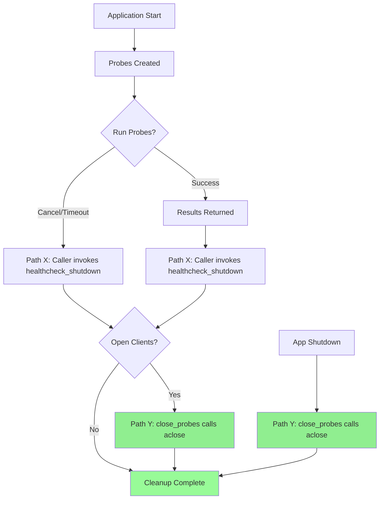

# Lifecycle and shutdown

## Open client mechanics

Checks that cache a client (Redis, Mongo, Kafka, OpenSearch, URL, RabbitMQ, PostgreSQL) keep one connection per instance. Such checks implement ``aclose()`` and are said to hold an **open client**. Open clients are **not** closed inside `run_probe`; they are closed only by the **documented shutdown path** below.

- **Which checks have open clients:** Any check that has an `aclose` method (e.g. those using `ClientCachingMixin`). Function-based checks and checks without `aclose` do not hold open clients.
- **Which shutdown path closes them:** Only `healthcheck_shutdown(probes)` or `close_probes(probes)` (path **Y**). On cancellation or timeout of `run_probe`, cached clients are **not** closed; the caller is responsible for calling the shutdown path (path **X**) so that **Y** runs.

## Cleanup paths (X and Y)

- **X (when cleanup runs):** The caller invokes `healthcheck_shutdown(probes)` (or `close_probes(probes)`) after using the probes—typically in the framework’s lifespan/shutdown hook. On cancellation or timeout of `run_probe`, `run_probe` does **not** close cached clients; the caller should still call the shutdown path so that resources are closed.
- **Y (what closes open clients):** `close_probes(probes)` (and thus `healthcheck_shutdown(probes)`) calls `aclose()` on each check that has it. Cached clients are closed only by this path, not inside `run_probe`.

After cancel or timeout there are no dangling background tasks from `run_probe` (the probe’s check tasks are cancelled); a cached client may remain open until the caller invokes **Y**.



## ProbeRunner (Advanced)

`ProbeRunner` is a context manager that automatically manages probe lifecycle and cleanup:

```python
from fast_healthchecks import ProbeRunner, RunPolicy, run_probe
from fast_healthchecks.checks import http

async def main():
    async with ProbeRunner() as runner:
        probes = [
            http("https://api.example.com/health", timeout_ms=1000),
        ]
        results = await runner.run_all(probes)
        # Cached clients are automatically closed when exiting the context

    # Resources are already cleaned up here
```

### Benefits

- **Automatic cleanup:** Cached clients are closed automatically when exiting the `async with` block—no need to call `healthcheck_shutdown()` manually.
- **Reusable runner:** The same `ProbeRunner` instance can be reused across multiple `run_all()` calls within the context.
- **Timeout control:** Pass `RunPolicy` to customize execution:

  ```python
  async with ProbeRunner(
      policy=RunPolicy(
          probe_timeout_ms=2000,
          execution="all",  # or "first"
          result_on_error="unhealthy"
      )
  ) as runner:
      results = await runner.run_all(probes)
  ```

### When to use

- **Use `ProbeRunner` when:** You want reusable runner with automatic resource cleanup, or need fine-grained control via `RunPolicy`.
- **Use `run_probe()` when:** Simple one-off probe execution is sufficient (cleanup still requires `healthcheck_shutdown()`).

### Manual resource management

If you prefer explicit control instead of using `async with`, you can manage the runner manually:

```python
from fast_healthchecks import ProbeRunner

async def main():
    runner = ProbeRunner()
    try:
        results = await runner.run_all(probes)
    finally:
        await runner.close()
```

### ProbeRunner with ASGI lifespan

For integration with ASGI applications (FastAPI, Starlette, Litestar), you can combine `ProbeRunner` with the framework's lifespan:

```python
from contextlib import asynccontextmanager
from fastapi import FastAPI
from fast_healthchecks import ProbeRunner, run_probe
from fast_healthchecks.checks import http

probes = [http("https://api.example.com/health")]

@asynccontextmanager
async def lifespan(app: FastAPI):
    runner = ProbeRunner()
    app.state.runner = runner
    yield
    await runner.close()

app = FastAPI(lifespan=lifespan)

@app.get("/health")
async def health():
    runner = app.state.runner
    return await runner.run_all(probes)
```

This pattern ensures proper cleanup when the application shuts down.

## Framework shutdown

To close health check resources on app shutdown:

- **FastAPI:** Store the router and call `await router.close()` in your [lifespan](https://fastapi.tiangolo.com/advanced/events/) context manager (after `yield`), or use `healthcheck_shutdown(probes)` and call the returned callback in lifespan.
- **FastStream:** Pass the callback from `healthcheck_shutdown(probes)` into your app's `on_shutdown` list, e.g. `AsgiFastStream(..., on_shutdown=[healthcheck_shutdown(probes)])`.
- **Litestar:** Pass the callback from `healthcheck_shutdown(probes)` into the app's `on_shutdown` list, e.g. `Litestar(..., on_shutdown=[healthcheck_shutdown(probes)])`.

Import `healthcheck_shutdown` from `fast_healthchecks.integrations.fastapi`, `fast_healthchecks.integrations.faststream`, or `fast_healthchecks.integrations.litestar`.
